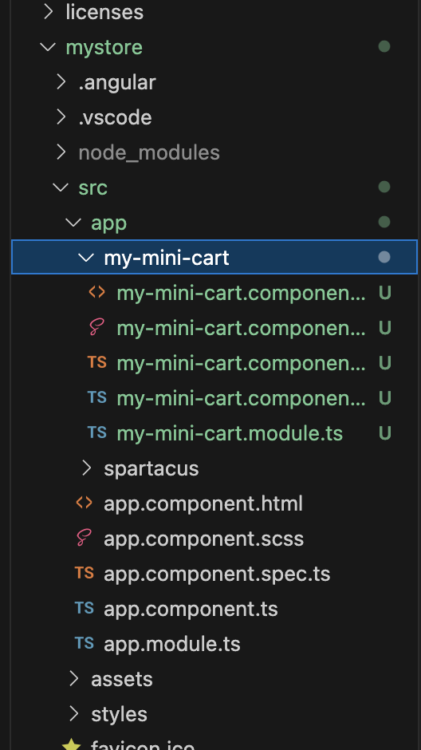

# 1. Customizing an existing Spartacus Component

In this exercise we will modify the OOTB behavior of an already existing component. For this example we will modify the MiniCart component. The first task will be to generate the module and the structure of our new component:

**Module Generation**

```bash
ng generate module my-mini-cart
```

**Component Generation**

```bash
ng generate component my-mini-cart
```

The next structure will be generated into the 'app' foler:

 //TODO

In order to override the already existing Minicart component we will add the following lines into the new component module:

```ts
...
import { CmsConfig, ConfigModule } from '@spartacus/core';
import { MyMiniCartComponent } from './my-mini-cart.component';
...

@NgModule({
  ...,
  imports: [
    CommonModule,
    ConfigModule.withConfig({
      cmsComponents:{
        MiniCartComponent:{ // CMS Default component to override
          component:MyMiniCartComponent // Our custom component
        }
      }
    } as CmsConfig)
  ]
})

...
```

It's necessary to import our custom module to our application. In this case, for the sake of simplicity, it is imported into app.module.ts.

```ts
...
import { MyMiniCartModule } from "./my-mini-cart/my-mini-cart.module";
...

@NgModule({
  declarations: [
    AppComponent // Make sure your component is not declared here because it will cause an error. This might happen if you generate the component before the module
  ],
  imports: [
    ...,
    MyMiniCartModule // Our custom module
  ],
  providers: [],
  bootstrap: [AppComponent]
})

...
```

With these changes you can see that the MiniCart has disappeared and now the default message that Angular CLI produces on newly generated components is displayed. This means that MiniCartComponent has been successfully mapped to MyMiniCartComponent.

 //TODO

We want to introduce some minor changes to the component so the idea is 

To recover the Mini-Cart’s previous behavior, you will have to modify the class of the new component and make it inherit from MiniCartComponent.
```ts
export class MyMiniCartComponent extends MiniCartComponent {
```

```html
<a [routerLink]="{cxRoute: 'cart'} | cxUrl">
    <cx-icon [type]="iconTypes.CART"></cx-icon>
</a>
```

You might find part of the code highlighted in red. That's because there are some missing imports. We will add them in the module of the component like this:

```ts
...
import { RouterModule } from '@angular/router';
import { CmsConfig, ConfigModule, UrlModule } from '@spartacus/core';
import { IconModule } from '@spartacus/storefront';
...

@NgModule({
  ...
  ,imports: [
    ...,
    IconModule,
    RouterModule,
    UrlModule,
    ...
```