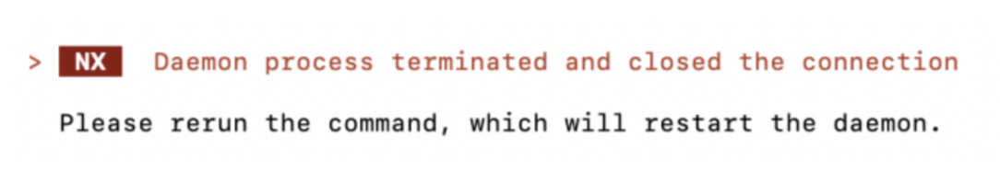
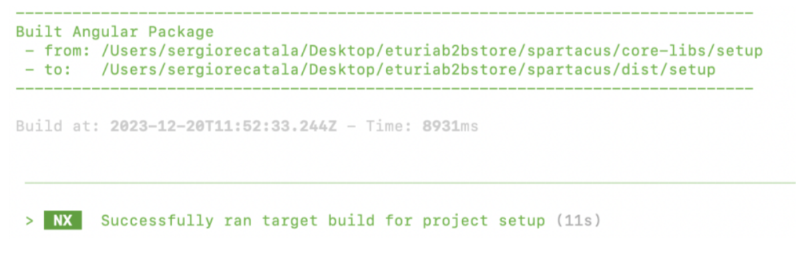
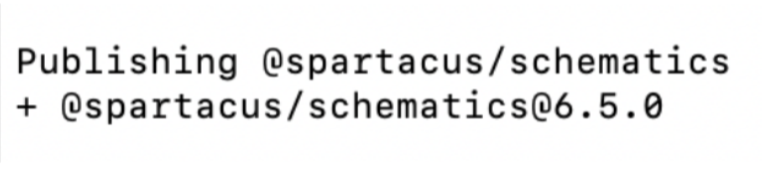
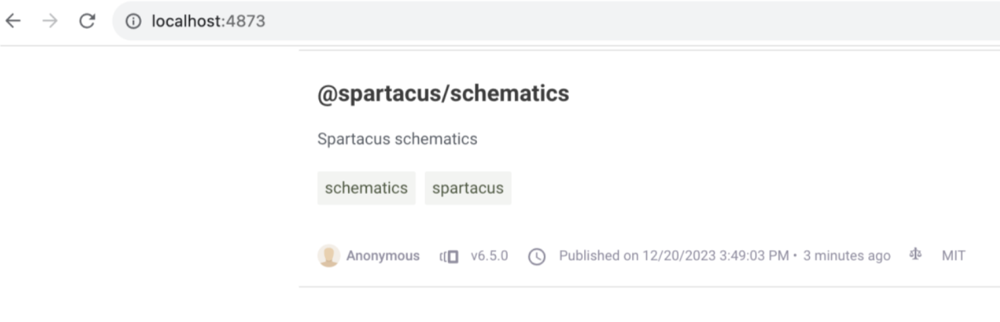
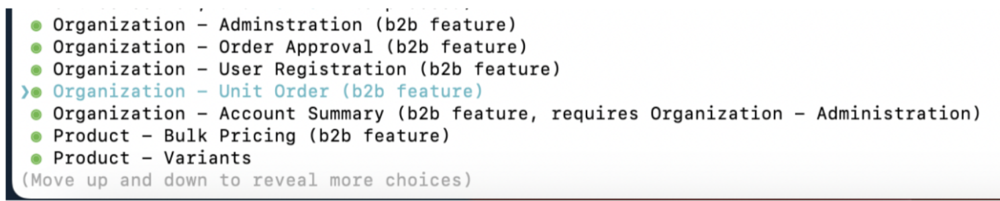

# Building Spartacus Libraries

To access the Spartacus libraries required for the project in RBSC, you need the appropriate licenses. For this training, we will generate them using the open-source code on GitHub. We will follow the [official instructions provided by SAP](https://github.com/SAP/spartacus/blob/release/6.0.x/docs/self-publishing-spartacus-libraries.md). Additionally, please carefully read the following considerations:

- In the step where you have to checkout a branch from the Spartacus repository, choose the latest release branch (such as release/6.6.x): `git checkout release/6.6.x`

- When building the libraries (npm run build:libs) you may encounter an error like this:

<div align="center">
   
</div>

In that case, try to move the project to a simple path such as Desktop (a short path and without spaces) and try again. If you still find issues, you can investigate the log at the following location:
`<project>/node_modules/.cache/nx/d/daemon.log`

- If the process finishes successfully you should see the following console
output:

<div align="center">
   
</div>

- There is a step that instructs you to publish the libraries to Verdaccio. Essentially, what we are doing is the following: we need to add the Spartacus packages to our Angular app, but they are not available under the npm public repositories. Therefore, we must publish these libraries to a local registry to make them accessible to npm. To achieve this, we installed a software called Verdaccio in a previous step. When you run `ts-node ./tools/schematics/testing` from the Spartacus folder, it will initiate the Verdaccio server on port 4873 and provide the option to publish the current Spartacus package. When you select the Publish option, pay attention to the Spartacus schematics version that gets installed:

<div align="center">
   
</div>

- You can also access verdaccio on a web browser to validate that the required packages have been successfully published:

<div align="center">
   
</div>

- You need to open a new console window and navigate to your Angular app. We are going to add the Spartacus schematics package to the main Angular app, so make sure you don’t close yet the console that is running Verdaccio, as the schematics package will be pulled from there:

  ```bash
  ng add @spartacus/schematics
  ```
- Proceed with the installation and make sure to select all features that belong to the Organization and Product blocks as well as the Checkout B2B and Checkout Scheduled Replenishment features:

<div align="center">
   
</div>

> [!IMPORTANT] 
> - Composable storefront does not support B2C and B2B storefronts running together in a single storefront application.
> - If you select a feature that is for B2B storefronts, the schematics automatically add any required B2B configurations if they are missing. If you install any of the following features, your composable storefront will automatically become a B2B storefront:
>   - Organization - Administration
>   - Organization - Order Approval
>   - Product - Bulk Pricing
>   - Product Configuration - CPQ Configurator"
