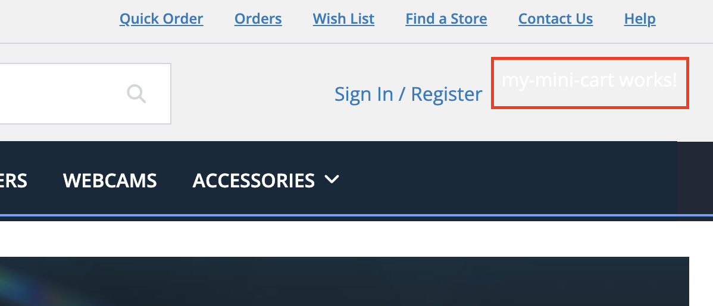
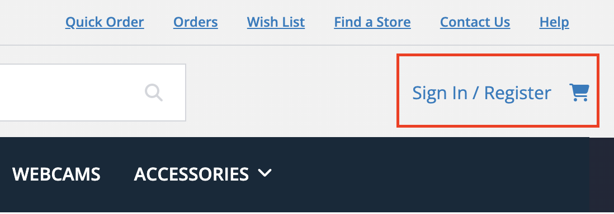
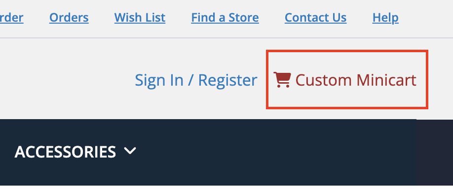

# 1. Customizing an existing Spartacus Component

In this exercise we will modify the OOTB behavior of an already existing component. For this example we will modify the MiniCart component. The first task will be to generate the module and the structure of our new component:

**Module Generation**

```sh
ng generate module my-mini-cart
```

**Component Generation**

```sh
ng generate component my-mini-cart
```

The next structure will be generated into the `src/app` folder:

<div align="center">
  
</div>

In order to override the already existing Minicart component we will add the following lines into the new component module:

```ts
...
import { CmsConfig, ConfigModule } from '@spartacus/core';
import { MyMiniCartComponent } from './my-mini-cart.component';
...

@NgModule({
  ...,
  imports: [
    CommonModule,
    ConfigModule.withConfig({
      cmsComponents:{
        MiniCartComponent:{ // CMS Default component to override
          component:MyMiniCartComponent // Our custom component
        }
      }
    } as CmsConfig)
  ]
})

...
```

It's necessary to import our custom module to our application. In this case, for the sake of simplicity, it is imported into `app.module.ts`.

```ts
...
import { MyMiniCartModule } from "./my-mini-cart/my-mini-cart.module";
...

@NgModule({
  declarations: [
    AppComponent // Make sure your component is not declared here because it will cause an error. This might happen if you generate the component before the module.
  ],
  imports: [
    ...,
    MyMiniCartModule // Our custom module
  ],
  providers: [],
  bootstrap: [AppComponent]
})

...
```

With these changes you can see that the MiniCart has disappeared and now the default message that Angular CLI produces on newly generated components is displayed. This means that the MiniCartComponent has been successfully mapped to MyMiniCartComponent.

<div align="center">
  
</div>

We want to introduce some minor changes to the component so the idea is to keep most of the previous behaviour. In order to do this we will inherit from the original MiniCartComponent:

```ts
export class MyMiniCartComponent extends MiniCartComponent {
```

We will also add the next html to match the original one:

```html
<a [routerLink]="{cxRoute: 'cart'} | cxUrl">
    <cx-icon [type]="iconTypes.CART"></cx-icon>
</a>
```

You might find part of the code highlighted in red. That's because there are some missing imports. We will add them in the module of the component like this:

```ts
...
import { RouterModule } from '@angular/router';
import { CmsConfig, ConfigModule, UrlModule } from '@spartacus/core';
import { IconModule } from '@spartacus/storefront';
...

@NgModule({
  ...
  ,imports: [
    ...,
    IconModule,
    RouterModule,
    UrlModule,
    ...
```

<div align="center">
  
</div>

Now we will introduce our customizations. We will change the color in the component .sass file and put some extra text in the html:

```css
a {
  color:brown;
}
```

```html
<a [routerLink]="{cxRoute:'cart'} | cxUrl">
  <cx-icon [type]="iconTypes.CART"></cx-icon>
  <span> Custom Minicart</span>
</a>
```

The final product will look like this:

<div align="center">
  
</div>

Congratulations! You have succesfully modified your first component in Spartacus! You can keep learning with the next [exercise](./02-creating-a-new-component.md).

If you encounter difficulties, feel free to compare your code with the provided [solution](https://github.com/ETuria-Labs/spartacus-training/compare/initial-angular-environment...01-customizing-an-existing-spartacus-component?expand=1).
