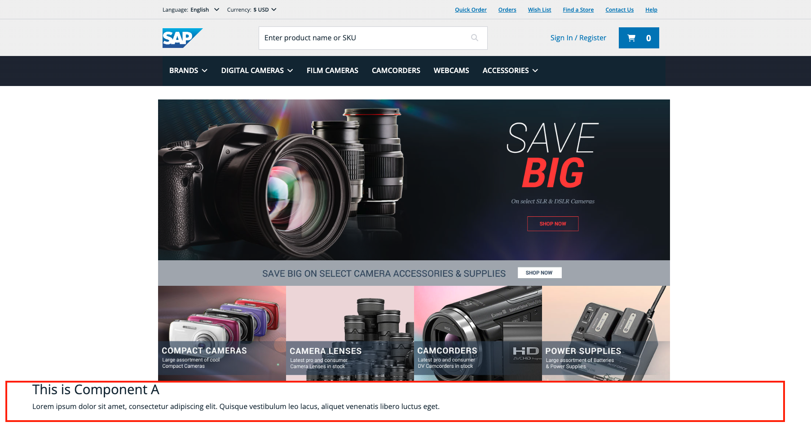

# 2. Creating a New Component

In this exercise, we will create a new component from scratch. For this purpose, we will have to create it in both Hybris and Spartacus.

## Component Creation in Hybris

The first step will be to declare the new component type in a `-items.xml` file. For this training we will be addding it in `spartacussampledata-items.xml`.

```xml
...
<itemtype code="ComponentAComponent" extends="SimpleCMSComponent"
          jaloclass="de.hybris.platform.spartacussampledata.jalo.ComponentAComponent">
    <attributes>
        <attribute qualifier="title" type="localized:java.lang.String">
            <persistence type="property"/>
        </attribute>
        <attribute qualifier="text" type="localized:java.lang.String">
            <persistence type="property">
                <columntype>
                    <value>HYBRIS.LONG_STRING</value>
                </columntype>
            </persistence>
        </attribute>
    </attributes>
</itemtype>
...
```

Remember to generate the component executing `ant all` on platform folder.

Now we will use impex to create the new component and assign it to a group and a page. You can either import it directly on `hac` or add it to an impex file and initialize.

```impex
$version=staged
$contentCatalog=electronics-spaContentCatalog
$contentCV=catalogVersion(CatalogVersion.catalog(Catalog.id[default=$contentCatalog]),CatalogVersion.version[default=$version])[default=$contentCatalog:$version]
$lang=en
  
INSERT_UPDATE ComponentAComponent; $contentCV[unique=true]; uid[unique = true]; name; title[lang = $lang]; text[lang = $lang];&componentRef  
;; componentATest ; Component A Test ; "This is Component A" ; "Lorem ipsum dolor sit amet, consectetur adipiscing elit. Quisque vestibulum leo lacus, aliquet venenatis libero luctus eget.";componentATest  
  
INSERT_UPDATE ComponentTypeGroups2ComponentType; source(code)[unique=true]; target(code)[unique=true]  
;wide;ComponentAComponent  
;narrow; ComponentAComponent  
  
INSERT_UPDATE ContentSlot;$contentCV[unique=true];uid[unique=true];name;active;cmsComponents(&componentRef)  
;;Section2CSlot-Homepage; Content for test Section 1 Slot;true;componentATest
```

> [!TIP]
> This impex uses the staged version by default, so you must sync the page via SmartEdit. However, if you prefer, you can switch the version to online to display the changes quickly.

> [!IMPORTANT]  
> You need to sync the *staging page* to publish the online version.


> [!TIP]
> For more information on how to create components in hybris with impex, please refer to this [external guide](http://javainsimpleway.com/how-to-add-new-custom-cms-component-type-to-a-page-in-hybris/)

## Component Creation in Spartacus

In the backend, we added our component to Section2CSlot-Homepage, but it's not visible at the moment. We will address that in our Spartacus frontend. Let's start creating the component in the command prompt:

```sh
ng g m component-a && ng g c component-a
```

In the `component-a.module.ts` file, we will have to link the Spartacus component to our custom CMS component. Add the component to *declarations* and then map it to the CMS component in *imports*.

```ts
import { NgModule } from '@angular/core';
import { CommonModule } from '@angular/common';
import { ComponentAComponent } from './component-a.component';
import { CmsConfig, ConfigModule } from '@spartacus/core';

@NgModule({
  declarations: [
    ComponentAComponent //Declare the hybris side component
  ],
  imports: [
    CommonModule,
    ConfigModule.withConfig({
      cmsComponents: {
        ComponentAComponent: { // CMS Component
          component: ComponentAComponent, // Spartacus Component
        },
      },
    } as CmsConfig)
  ]
})
export class ComponentAModule { }
```

Now we should import the compoment module to the app. This can be done in two ways, either by directly adding it to the *Imports* section of `app.module`, or by using *lazy loading*.

In this example you will see how to do it with *lazy loading*:

```ts
...
import { provideConfig } from '@spartacus/core';

@NgModule({
  ...,
  providers:[
    provideConfig({
      featureModules:{
        ComponentA:{
          module:()=> import('./component-a/component-a.module').then(m => m.ComponentAModule),
          cmsComponents:[
            'ComponentAComponent'
          ]
        }
      }
    })
  ],
  bootstrap: [AppComponent],
})
export class AppModule {}
```

You need to create an interface that describes the data that the API sends about the component. Use these commands:

```sh
ng g i component-a/Cms-component-a-component
```

Edit the `cms-component-a-component.ts` It would look like this.

```ts
import { CmsComponent } from "@spartacus/core";

export interface CmsComponentAComponent extends CmsComponent{
    title: string
    text: string
}
```

Now you will work the logic. It will be simple because you will only receive the information that brings the CMS component:

Inject the `CmsComponentData` data stream (it's a generic type, so you should use the interface for your component here).

Finally, assign the `Observable` provided by the data stream to one of the properties of your controller, so that you can consume it from the view.

It would look like this:

```ts
import { Component } from '@angular/core';
import { CmsComponentAComponent } from './cms-component-a-component';
import { Observable } from 'rxjs';
import { CmsComponentData } from '@spartacus/storefront';

@Component({
  selector: 'app-component-a',
  templateUrl: './component-a.component.html',
  styleUrls: ['./component-a.component.scss']
})
export class ComponentAComponent {

  constructor(protected component: CmsComponentData<CmsComponentAComponent> ){}

  data$: Observable<CmsComponentAComponent> = this.component.data$;
  
}
```

In the template, use the async pipe to subscribe to the `Observable` and a conditional to prevent rendering issues.

```html
<ng-container *ngIf="data$ | async as data">
    <h1>{{data.title}}</h1>
    <p>{{data.text}}</p>
</ng-container>
```

Finally, this is how your component looks on the page:


