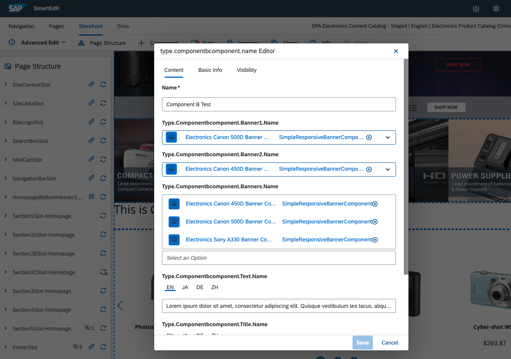
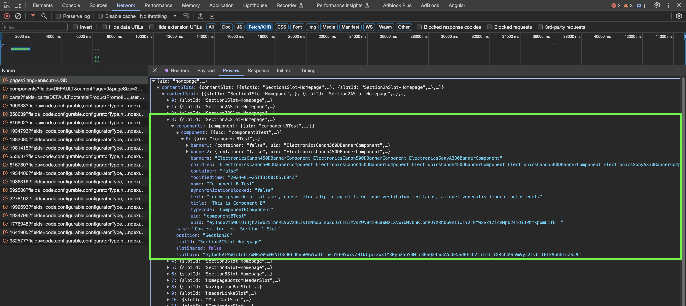

# 3. Creating a New Component with Nested Components

In this exercise, we will create a new component with nested components. For this purpose, we will have to create a new component in both Hybris and Spartacus as we did in the last lesson.

## Component Creation in Hybris

We will start generating a new component type in Hybris, by adding it to the `-items.xml` file:

```xml
...
<collectiontypes>
    <collectiontype elementtype="SimpleResponsiveBannerComponent" code="SimpleResponsiveBanners" type="list" />
</collectiontypes>
...
<itemtypes>
...
  <itemtype code="ComponentBComponent" extends="SimpleCMSComponent"
      jaloclass="de.hybris.platform.spartacussampledata.jalo.ComponentBComponent">
      <attributes>
          <attribute qualifier="title" type="localized:java.lang.String">
              <persistence type="property"/>
          </attribute>
          <attribute qualifier="text" type="localized:java.lang.String">
              <persistence type="property">
                  <columntype>
                      <value>HYBRIS.LONG_STRING</value>
                  </columntype>
              </persistence>
          </attribute>
          <attribute qualifier="banners" type="SimpleResponsiveBanners">
              <persistence type="property"/>
          </attribute>
          <attribute qualifier="banner1" type="SimpleResponsiveBannerComponent">
              <persistence type="property"/>
          </attribute>
          <attribute qualifier="banner2" type="SimpleResponsiveBannerComponent">
              <persistence type="property"/>
          </attribute>
      </attributes>
  </itemtype>
...   
```

For this exercise we will be making a component with three properties related to child components: a collection of `SimpleResponsiveBannerComponent` and two `SimpleResponsiveBannerComponent`

Remember to generate the component executing `ant all` or `ant updatesystem` on platform folder.

Now we will use impex to create the new component and assign it to a group and a page. You can either import it directly on `hac` or add it to an impex file and initialize.

```impex
$version=Staged
$contentCatalog=electronics-spaContentCatalog
$contentCV=catalogVersion(CatalogVersion.catalog(Catalog.id[default=$contentCatalog]),CatalogVersion.version[default=$version])[default=$contentCatalog:$version]
$lang=en
  
INSERT_UPDATE ComponentBComponent; $contentCV[unique = true]; uid[unique = true]; name             ; title[lang = $lang]   ; text[lang = $lang]                                                                                                             ; &componentRef
                                 ;                          ; componentBTest    ; Component B Test ; "This is Component B" ; "Lorem ipsum dolor sit amet, consectetur adipiscing elit. Quisque vestibulum leo lacus, aliquet venenatis libero luctus eget." ; componentBTest

INSERT_UPDATE ComponentTypeGroups2ComponentType; source(code)[unique = true]; target(code)[unique = true]
                                               ; wide                       ; componentBTest
                                               ; narrow                     ; componentBTest

INSERT_UPDATE ContentSlot; $contentCV[unique = true]; uid[unique = true]     ; name                            ; active; cmsComponents(&componentRef)
                         ;                          ; Section2CSlot-Homepage ; Content for test Section 1 Slot ; true  ; componentBTest
```

> [!TIP]
> This impex uses the Staged version by default, so you must sync the page via SmartEdit. However, if you prefer, you can switch the version to online to display the changes quickly.

> [!IMPORTANT]
> In order to fill the component completely we must add banners. We will do this in SmartEdit. If you can't see your page in SmartEdit try to start the frontend application again using `ng serve --ssl`. This will start the server using *https* protocol so you will have to enter the website using https://localhost:4200/electronics-spa/en/USD/
> <div align="center">
> 
> </div>

## Component Creation in Spartacus

We will generate our component in Spartacus using the following command:

```sh
ng g m component-b && ng g c component-b
```

Now we will link our frontend and backend component. We will configure it in our just generated `component-b.module.ts` file. We will also import the `PageComponentModule` because we will be using it later on the exercise.

```ts
import { NgModule } from '@angular/core';
import { CommonModule } from '@angular/common';
import { ComponentBComponent } from './component-b.component';
import { CmsConfig, ConfigModule } from '@spartacus/core';
import { PageComponentModule } from '@spartacus/storefront';

@NgModule({
  declarations: [ComponentBComponent],
  imports: [
    CommonModule,
    PageComponentModule,
    ConfigModule.withConfig({
      cmsComponents: {
        ComponentBComponent: { // CMS Component
          component: ComponentBComponent, // Spartacus Component
        },
      },
    } as CmsConfig),
  ],
})
export class ComponentBModule {}
```

Now we should import the component module to the app using *lazy loading* as we did in the previous exercise:

```ts
...
@NgModule({
  ...,
  providers:[
    provideConfig({
      featureModules:{
        ...,
        ComponentB:{
          module:()=> import('./component-b/component-b.module').then(m => m.ComponentBModule),
          cmsComponents:[
            'ComponentBComponent'
          ]
        }
      }
    })
  ]
  ...
})
```

We will need an interface to decribe the data that we are going to receive from the backend about the component. Open your command prompt and use the following command:

```sh
ng g i component-b/cms-Component-b-component
```

We will edit the `cms-component-b-component.ts` to look like this:

```ts
import { CmsBannerComponent, CmsComponent } from "@spartacus/core";

export interface CmsComponentB extends CmsComponent{
    title: string,
    text: string,
    banners: string,
    banner1:CmsBannerComponent,
    banner2:CmsBannerComponent,
}
```

Now we will add some logic to the component in `component-b.component.ts`. We will explain this code in the following section:

```ts
import { Component } from '@angular/core';
import { CmsComponent, CmsService, ContentSlotComponentData} from '@spartacus/core';
import { CmsComponentData } from '@spartacus/storefront';
import { CmsComponentB } from './cms-component-b-component';
import { Observable, combineLatest } from 'rxjs';
import { map, switchMap } from 'rxjs/operators';

@Component({
  selector: 'app-component-b',
  templateUrl: './component-b.component.html',
  styleUrls: ['./component-b.component.scss'],
})
export class ComponentBComponent {
  constructor(
    public componentData: CmsComponentData<CmsComponentB>,
    private cmsService: CmsService
  ) {}

  public data$: Observable<CmsComponentB> = this.componentData.data$;

  public banner$: Observable<ContentSlotComponentData[]> = this.data$.pipe(
    switchMap((data) => {
      return combineLatest(
        this.getComponentUids(data.banners).map((component) =>
          this.cmsService.getComponentData<CmsComponent>(component)
        )
      );
    }),
    map<CmsComponent[], ContentSlotComponentData[]>((array) =>
      array.map((cmsComponent) => ({
        uid: cmsComponent.uid,
        flexType: cmsComponent.typeCode,
        typeCode: cmsComponent.typeCode,
      }))
    )
  );

  public getComponentUids(components?: string): string[] {
    return components?.trim().split(' ') || [];
  }
}
```

## Working with CMS API Responses for Rendering

To understand the next actions, let's look at the response of the CMS API call in the Browser:

*inspect > Network Tab > click on pages?lang=en&curr=USD > Preview Tab > unfold ContentSlots > unfold ContentSlot > unfold 3*

<div align="center">
  
</div>

As you can see, the components that we added directly in the component contain all the necessary data for rendering. On the other hand, the collection of banners has been transformed into a string with the ID of the child components. Therefore, you will have to handle them differently.

### Handling Child Components

This is the simplest case. Once again, we will assign the observable of the data stream to one of the properties of the component:

```ts
data$: Observable<CmsComponentBComponent> = this.componentData.data$;
```

In the template, we'll only need to use one of Spartacus's Out of the Box directives: `cxComponentWrapper`. This directive takes a `ContentSlotComponentData` as a parameter (conversion is done in the template itself).

```html
<ng-container *ngIf="data$ | async as data; loading">
  <h1 *ngIf="data.title">{{ data.title }}</h1>
  <hr />
  <div class="row">
    <div class="col-12 col-md-6" *ngIf="data.banner1 as banner1">
      <ng-template
        [cxComponentWrapper]="{
              uid: banner1.uid,
              flexType: banner1.typeCode,
              typeCode: banner1.typeCode,
          }"
      ></ng-template>
    </div>
    <div class="col-12 col-md-6" *ngIf="data.banner2 as banner2">
      <ng-template
        [cxComponentWrapper]="{
              uid: banner2.uid,
              flexType: banner2.typeCode,
              typeCode: banner2.typeCode,
          }"
      ></ng-template>
    </div>
  </div>
</ng-container>
```

### Handling List of Components

For this case we will have to convert a list of IDs into renderable components. There are many ways to resolve this problem. For this training we will create a new property in the component controller called banner which will be an `Observable` of a list of `ContentSlotComponentData`.

We will use the following *RxJs operators* to transform the data:

- `switchMap`: transforms the Observable into another Observable with the data that it receives from the first one.
- `combineLatest`: transforms a list of Observables into the Observable of a list.
- `map`: transforms the results of an Observable

```ts
public banner$: Observable<ContentSlotComponentData[]> = this.data$.pipe(
    switchMap((data) => {
      return combineLatest(
        this.getComponentUids(data.banners).map((component) =>
          this.cmsService.getComponentData<CmsComponent>(component)
        )
      );
    }),
    map<CmsComponent[], ContentSlotComponentData[]>((array) =>
      array.map((cmsComponent) => ({
        uid: cmsComponent.uid,
        flexType: cmsComponent.typeCode,
        typeCode: cmsComponent.typeCode,
      }))
    )
  );
```

Finally, we will subscribe to this Observable from the template, as we did previously:

```html
    <ng-container *ngIf="banner$ | async as banners">
      <div class="row">
        <div
          class="col-12 col-md-6 col-lg-4 col-xl-3"
          *ngFor="let banner of banners">
          <ng-template [cxComponentWrapper]="banner"></ng-template>
        </div>
      </div>
    </ng-container>
```

> [!TIP]
> *RxJS* is a library for composing asynchronous and event-based programs. Learning about it is very useful to understand how Spartacus works. To learn more visit the [official documentation](https://rxjs.dev/guide/overview).

The final result will look like this:

<div align="center">
  
</div>

Congratulations! You have succesfully created your first component with nested components in Spartacus! You can keep learning with the next [exercise](./04-creating-a-new-component-with-a-extra-logic.md).

If you encounter difficulties, feel free to compare your code with the provided [solution](https://github.com/ETuria-Labs/spartacus-training/compare/02-creating-a-new-component...03-creating-a-new-component-with-nested-components?expand=1).
