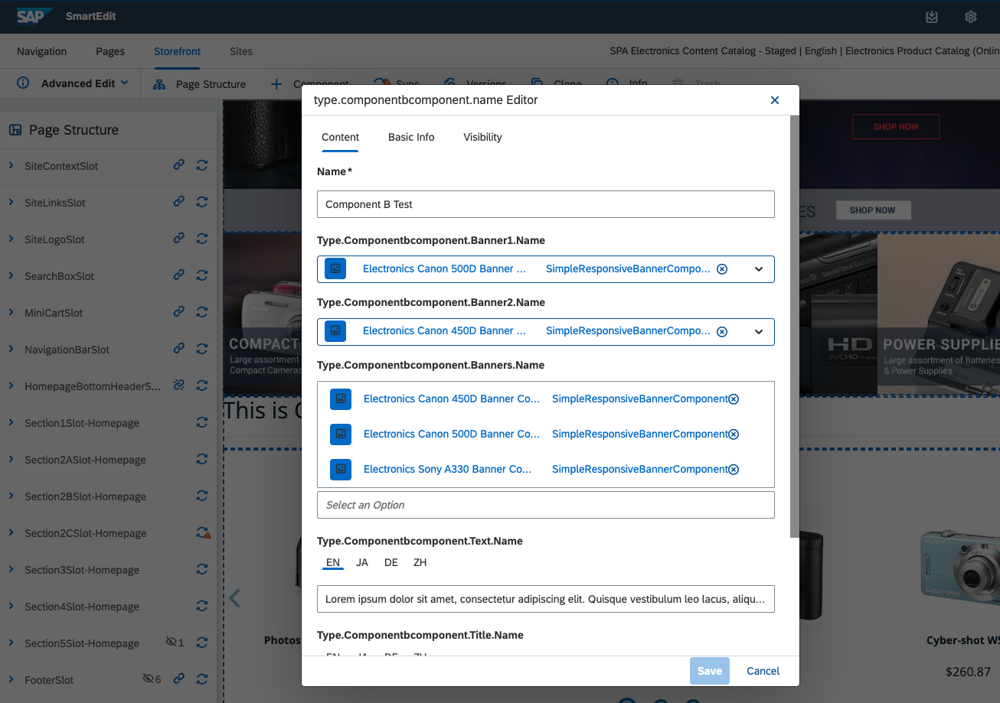
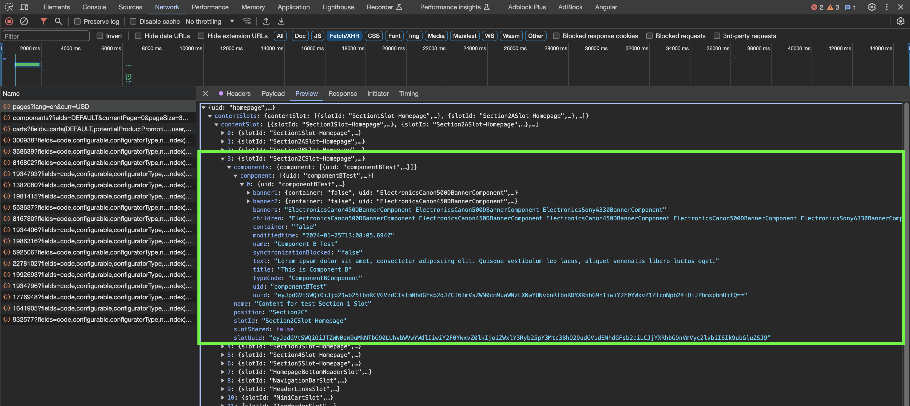

# 3. Creating a new Component with nested Components

## 1. Component Creation in Hybris:
Generate a new component type in Hybris, and add it to the `-items.xml` file, e.g., `spartacussampledata-items.xml`.

```xml
...
    <collectiontypes>
        <collectiontype elementtype="SimpleResponsiveBannerComponent" code="SimpleResponsiveBanners" type="set" />
    </collectiontypes>
...

        <itemtype code="ComponentBComponent" extends="SimpleCMSComponent"
jaloclass="de.hybris.platform.spartacussampledata.jalo.ComponentBComponent">
            <attributes>
                <attribute qualifier="title" type="localized:java.lang.String">
                    <persistence type="property"/>
                </attribute>
                <attribute qualifier="text" type="localized:java.lang.String">
                    <persistence type="property">
                        <columntype>
                            <value>HYBRIS.LONG_STRING</value>
                        </columntype>
                    </persistence>
                </attribute>
                <attribute qualifier="banners" type="SimpleResponsiveBanners">
                    <persistence type="property"/>
                </attribute>
                <attribute qualifier="banner1" type="SimpleResponsiveBannerComponent">
                    <persistence type="property"/>
                </attribute>
                <attribute qualifier="banner2" type="SimpleResponsiveBannerComponent">
                    <persistence type="property"/>
                </attribute>
            </attributes>
        </itemtype>
    </itemtypes>
 ...   
```

In this case, your component has three properties related to child components: a collections of `SimpleResponsiveBannerComponents` and two `SimpleResponsiveBannerComponents`. This way, you'll be able to see the two ways of handling child components.

Take your time to instantiate the component in your application and add it to a page yourself.

However, you can use the following impex:

```impex
$contentCatalog=electronics-spaContentCatalog  
$contentCV=catalogVersion(CatalogVersion.catalog(Catalog.id[default=$contentCatalog]),CatalogVersion.version[default=Staged])[default=$contentCatalog:Staged]  
$lang=en  
  
INSERT_UPDATE ComponentBComponent; $contentCV[unique=true]; uid[unique = true]; name; title[lang = $lang]; text[lang = $lang];&componentRef  
;; componentBTest ; Component B Test ; "This is Component B" ; "Lorem ipsum dolor sit amet, consectetur adipiscing elit. Quisque vestibulum leo lacus, aliquet venenatis libero luctus eget.";componentATest  
  
INSERT_UPDATE ComponentTypeGroups2ComponentType; source(code)[unique=true]; target(code)[unique=true]  
;wide;ComponentAComponent  
;narrow; ComponentAComponent  
  
INSERT_UPDATE ContentSlot;$contentCV[unique=true];uid[unique=true];name;active;cmsComponents(&componentRef)  
;;Section2CSlot-Homepage; Content for test Section 1 Slot;true;componentBTest
```

>[!IMPORTANT]
>You must add banners to completely fill the component; for that, it is a good idea to use SmartEdit for editing.
>
>

## 2. Component Creation in Spartacus

You will need to create your component in Spartacus with its respective module.

```sh
ng g m component-b
ng g c component-b
```

Now link your Spartacus component to the CMS component-b. To do this, in the `component-b.module.ts` file, you will link it in the imports section.

```ts
import { NgModule } from '@angular/core';
import { CommonModule } from '@angular/common';
import { ComponentBComponent } from './component-b.component';
import { CmsConfig, ConfigModule } from '@spartacus/core';
import { PageComponentModule } from '@spartacus/storefront';

@NgModule({
  declarations: [ComponentBComponent],
  imports: [
    CommonModule,
    PageComponentModule,
    ConfigModule.withConfig({
      cmsComponents: {
        ComponentBComponent: {
          // CMS Component
          component: ComponentBComponent, // Spartacus Component
        },
      },
    } as CmsConfig),
  ],
})
export class ComponentBModule {}
```

> [!IMPORTANT]  
> Notice that you need to import the PageComponentModule because it is necessary to use `[cxComponentWrapper]` in later steps.

The next thing you need to do is import the new component module (in this case, we use the `app.module.ts`, but it could be another module loaded in the application, depending on the structure of your project).

Next, import the new component module with lazy loading. In the `cmsComponents` section of this configuration, specify which components will trigger the lazy loading of the module.

```ts
import { HttpClientModule } from '@angular/common/http';
import { NgModule } from '@angular/core';
import { BrowserModule } from '@angular/platform-browser';
import { EffectsModule } from '@ngrx/effects';
import { StoreModule } from '@ngrx/store';
import { AppRoutingModule} from '@spartacus/storefront';
import { AppComponent } from './app.component';
import { SpartacusModule } from './spartacus/spartacus.module';
import { provideConfig } from '@spartacus/core';

@NgModule({
  declarations: [AppComponent],
  imports: [
    BrowserModule,
    HttpClientModule,
    AppRoutingModule,
    StoreModule.forRoot({}),
    EffectsModule.forRoot([]),
    SpartacusModule,
  ],
  providers:[
  ...
    provideConfig({
      featureModules:{
        ComponentB:{
          module:()=> import('./component-b/component-b.module').then(m => m.ComponentBModule),
          cmsComponents:[
            'ComponentBComponent'
          ]
        }
      }
    })
    ...
  ],
  bootstrap: [AppComponent],
})
export class AppModule {}
```

Before working on the logic of component-b, you will need an interface.

```sh
ng g i component-b/cms-Component-b-component
```

```ts
import { CmsBannerComponent, CmsComponent } from "@spartacus/core";

export interface CmsComponentB extends CmsComponent{
    title: string,
    text: string,
    banners: string,
    banner1:CmsBannerComponent,
    banner2:CmsBannerComponent,
}
```

Now let's look at the logic in the `component-b.component.ts` file.

```ts
import { Component } from '@angular/core';
import {
  CmsComponent,
  CmsService,
  ContentSlotComponentData,
} from '@spartacus/core';
import { CmsComponentData } from '@spartacus/storefront';
import { CmsComponentBComponent } from './cms-component-b-component';
import { Observable, combineLatest } from 'rxjs';
import { map, switchMap } from 'rxjs/operators';

@Component({
  selector: 'app-component-b',
  templateUrl: './component-b.component.html',
  styleUrls: ['./component-b.component.scss'],
})
export class ComponentBComponent {
  constructor(
    public componentData: CmsComponentData<CmsComponentBComponent>,
    private cmsService: CmsService
  ) {}

  public data$: Observable<CmsComponentBComponent> = this.componentData.data$;

  public banner$: Observable<ContentSlotComponentData[]> = this.data$.pipe(
    switchMap((data) => {
      return combineLatest(
        this.getComponentUids(data.banners).map((component) =>
          this.cmsService.getComponentData<CmsComponent>(component)
        )
      );
    }),
    map<CmsComponent[], ContentSlotComponentData[]>((array) =>
      array.map((cmsComponent) => ({
        uid: cmsComponent.uid,
        flexType: cmsComponent.typeCode,
        typeCode: cmsComponent.typeCode,
      }))
    )
  );

  public getComponentUids(components?: string): string[] {
    return components?.trim().split(' ') || [];
  }
}
```

## 3. Working with CMS API Responses for Rendering

To understand the next processes, look at the response of the CMS API call in your Browser.



As you can see, the components that we added directly in the component contain all the necessary data for rendering. On the other hand, the collection of banners has been transformed into a string with the ID of the child components. Therefore, you will have to handle them differently.

### 1. Handling Child Components

This is the simplest case. Again, assign the Observable of the data stream to one of the properties of the component

```ts
data$: Observable<CmsComponentBComponent> = this.componentData.data$;
```

In the template, you'll only need to use one of Spartacus's Out of the Box directives: `cxComponentWrapper`. This directive takes a `ContentSlotComponentData` as a parameter (conversion is done in the template itself).

```html
<ng-container *ngIf="data$ | async as data">
  <h1 *ngIf="data.title">{{ data.title }}</h1>
  <hr />
  <div class="row">
    <div class="col-12 col-md-6" *ngIf="data.banner1 as banner1">
      <ng-template
        [cxComponentWrapper]="{
              uid: banner1.uid,
              flexType: banner1.typeCode,
              typeCode: banner1.typeCode,
          }"
      ></ng-template>
    </div>
  ...
</ng-container>
```

### 2. Handling List of components

You will have to convert this list of IDs into renderable components. There are several approaches to resolve this. In this case, you will create a new property in your component's controller: transforming the Observable `data$` into an Observable of a list of `ContentSlotComponentData`.

Using the split method, you convert the string with the IDs into a list of IDs, and use the getComponentData method of the Spartacus CmsService to convert it into a list of Observables.

Use the following RxJs operators:
- **switchMap**: transforms the Observable into another Observable with the data that it receives from the first one.
- **combineLatest:** transforms a list of Observables into the Observable of a list.
- **map:** transforms the results of an Observable

Finally, you will subscribe to this Observable from the template, as you did previously:

```html
    <ng-container *ngIf="banner$ | async as banners">
      <div class="row">
        <div
          class="col-12 col-md-6 col-lg-4 col-xl-3"
          *ngFor="let banner of banners"
        >
          <ng-template [cxComponentWrapper]="banner"></ng-template>
        </div>
      </div>
    </ng-container>
```

> [!TIP]
> RxJS is a library for composing asynchronous and event-based programs. Learning about it is very useful to understand how Spartacus works. To learn more visit [rxjs.dev](https://rxjs.dev/guide/overview)

The final template will look like this:

```html
<ng-container *ngIf="data$ | async as data; loading">
  <h1 *ngIf="data.title">{{ data.title }}</h1>
  <hr />
  <div class="row">
    <div class="col-12 col-md-6" *ngIf="data.banner1 as banner1">
      <ng-template
        [cxComponentWrapper]="{
              uid: banner1.uid,
              flexType: banner1.typeCode,
              typeCode: banner1.typeCode,
          }"
      ></ng-template>
    </div>
    <div class="col-12 col-md-6" *ngIf="data.banner2 as banner2">
      <ng-template
        [cxComponentWrapper]="{
              uid: banner2.uid,
              flexType: banner2.typeCode,
              typeCode: banner2.typeCode,
          }"
      ></ng-template>
    </div>
  </div>
    <hr/>
    <ng-container *ngIf="banner$ | async as banners">
      <div class="row">
        <div
          class="col-12 col-md-6 col-lg-4 col-xl-3"
          *ngFor="let banner of banners"
        >
          <ng-template [cxComponentWrapper]="banner"></ng-template>
        </div>
      </div>
    </ng-container>
  <hr/>
</ng-container>
```

Result:

