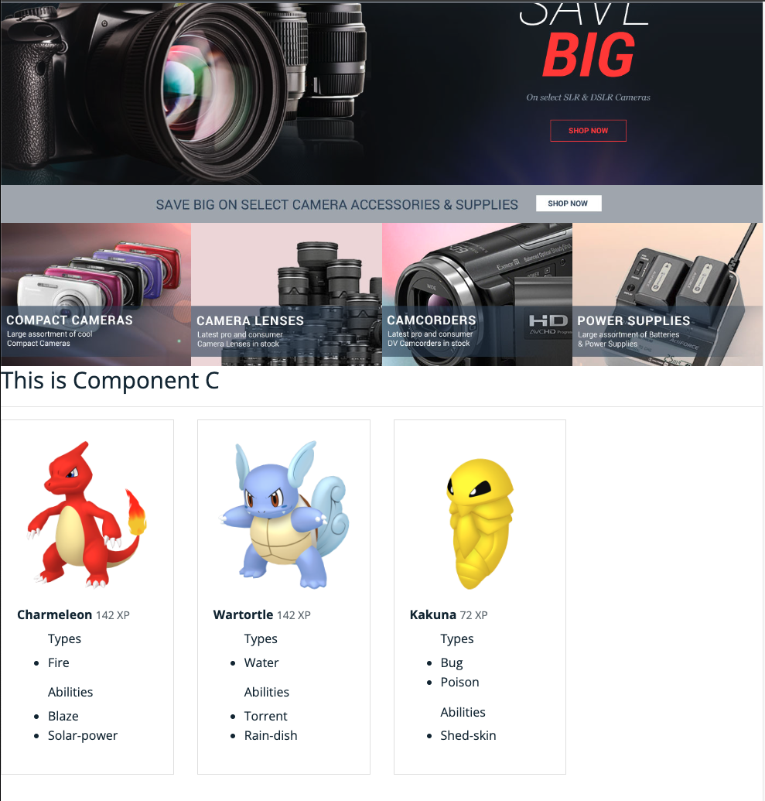

# 3. Creating a new component with a extra logic

Below you will see an example of a custom component with some added logic. You will start by generating the component and instantiating it.

## 1. Creation of Component C

Follow this scheme:

```xml
        <itemtype code="ComponentCComponent" extends="SimpleCmsComponent"
                  jaloclass="de.hybris.platform.spartacussampledata.jalo.ComponentCComponent">
            <attributes>
                <attribute qualifier="title" type="localized:java.lang.String">
                    <persistence type="property"/>
                </attribute>
                <attribute qualifier="fooCodes" type="java.lang.String">
                    <persistence type="property">
                        <columntype>
                            <value>HYBRIS.LONG_STRING</value>
                        </columntype>
                    </persistence>
                </attribute>
            </attributes>
        </itemtype>
```

It will be a very simple CMS component, with a title and a list of codes, which in this case will be represented as a text string. From Spartacus, you will take this list and make calls to an external API. Finally, you will display these results as cards.

you can use the following impex:

```impex
$version=staged
$contentCatalog=electronics-spaContentCatalog
$contentCV=catalogVersion(CatalogVersion.catalog(Catalog.id[default=$contentCatalog]),CatalogVersion.version[default=$version])[default=$contentCatalog:$version]
$lang=en

INSERT_UPDATE ComponentCComponent; $contentCV[unique=true]; uid[unique = true]; name; title[lang = $lang]; fooCodes;&componentRef
;; componentCTest ; Component C Test ; "This is Component C" ; charmeleon,wartortle,kakuna;componentCTest

INSERT_UPDATE ComponentTypeGroups2ComponentType; source(code)[unique=true]; target(code)[unique=true]
;wide;ComponentCComponent
;narrow; ComponentCComponent

INSERT_UPDATE ContentSlot;$contentCV[unique=true];uid[unique=true];name;active;cmsComponents(&componentRef)
;;Section2CSlot-Homepage; Content for test Section 1 Slot;true;componentCTest
```

>[!TIP]
>This impex uses the staged version by default, so you must sync the page via SmartEdit. However, if you prefer, you can switch the version to online to display the changes quickly.

Create a new `Component C`, following the usual operations as already explained in the previous exercises of this course:

> [!INFO] 
Exercise of Interest.
> - [Customizing an existing Spartacus Component](./resources/docs//exercises/01-customizing-an-existing-spartacus-component.md)
> - [Creating a new component](./resources/docs/exercises/02-creating-a-new-component.md)
> - [Creating a new Component with nested Components](./resources/docs/exercises/03-creating-a-new-component-with-nested-components.md)

- Generate a module for the component.
- Generate the component.
- Map the CMS component into the Spartacus component.
- Add the component module to the application (with lazy load as recommended option)

## 2.Creating a new Service

Next, you will use the Angular CLI to generate a new service to communicate with the external API.

>[!Important]
>For this exercise, add the TypeScript-implemented library [pokenode-ts](https://github.com/Gabb-c/pokenode-ts) to your Spartacus project. This library is used to query the Pokémon data.

```sh
ng g s services/poke
```

You will implement the service with a method that receives a list of codes and returns the Observable of a list of Pokemon.

```ts
import { Injectable } from '@angular/core';
import { MainClient, Pokemon } from 'pokenode-ts';
import { Observable, combineLatest, from } from 'rxjs';

@Injectable({
  providedIn: 'root'
})
export class PokeService {

  protected mainClient: MainClient;

  constructor() {
    this.mainClient = new MainClient()
   }

   getPokemonsByNameList(codes: string []): Observable<Pokemon[]>{
    return combineLatest(
      codes.map((code) => from(this.mainClient.pokemon.getPokemonByName(code)))
    );
   }
}
```

## 3.Creating a Presenter component

For design reasons, you will also include a Presenter (or Dummy component) to render the cards (you will use the Container Pattern).

Created a new standalone component `component-pokemon`.

```sh
ng g c pokemon --standalone 
```

`pokemon.component.ts`
```ts
import { Component, Input } from '@angular/core';
import { CommonModule } from '@angular/common';
import { Pokemon } from 'pokenode-ts';
@Component({
  selector: 'app-pokemon',
  standalone: true,
  imports: [CommonModule],
  templateUrl: './pokemon.component.html',
  styleUrls: ['./pokemon.component.scss']
})
export class PokemonComponent {
  @Input() pokemon?: Pokemon;
}

```

Add to imports seccion into `component-c.module.ts`

```ts
import { NgModule } from '@angular/core';
import { CommonModule } from '@angular/common';
import { ComponentCComponent } from './component-c.component';
import { ConfigModule, CmsConfig } from '@spartacus/core';
import { PokemonComponent } from '../pokemon/pokemon.component';

@NgModule({
  declarations: [
    ComponentCComponent,
  ],
  imports: [
    CommonModule,
    PokemonComponent,
    ConfigModule.withConfig({
      cmsComponents: {
        ComponentCComponent: {
          // CMS Component
          component: ComponentCComponent, // Spartacus Component
        },
      },
    } as CmsConfig),
  ]
})
export class ComponentCModule { }
```

## 4.Integrating Components and Services

Use these commands to create a new interface:

```sh
ng g c i pokemon/pokemon
``` 

Generate a new Interface that describes the data that your component receives from the CMS API. 

```sh
ng g i component-c/cms-component-c-component
```

```ts
export interface CmsPokemonComponent {
    title?: string;
    fooCodes?: string;
}
```

Inject the `PokeService` and the `CmsComponentData` data stream in your component’s controller.

You will use the `CmsComponentData` to obtain an Observable with the data from the CMS and you will use the `RxJs`tap operator and the `PokeService` to transform this Observable into the Observable of a Pokemon list. You will assign this last Observable to another property inside the component.

```ts
import { Component } from '@angular/core';
import { Observable } from 'rxjs';
import { CmsComponentCComponent } from './cms-component-c-component';
import { PokeService } from '../services/poke.service';
import { CmsComponentData } from '@spartacus/storefront';
import { tap } from 'rxjs/operators';
import { Pokemon } from 'pokenode-ts';

@Component({
  selector: 'app-component-c',
  templateUrl: './component-c.component.html',
  styleUrls: ['./component-c.component.scss'],
})
export class ComponentCComponent {
  public data$: Observable<CmsComponentCComponent> =
    this.componentData.data$.pipe(
      tap((data) => {
        const codes = data.fooCodes?.split(',') ?? [];
        this.pokemons$ = this.pokeService.getPokemonsByNameList(codes);
      })
    );
  public pokemons$?: Observable<Pokemon[]>;

  constructor(
    protected componentData: CmsComponentData<CmsComponentCComponent>,
    protected pokeService: PokeService
  ) {}
}
```

In the view, subscribe to both Observables with the async pipe and display the results. To render the cards with the Pokemon you will make use of the Presenter component.

```html
<ng-container *ngIf="data$ | async as data">
    <h1>{{data.title}}</h1>
    <hr/>
</ng-container>
<div *ngIf="pokemons$ | async as pokemons" class="row">
    <div class="col-3" *ngFor="let pokemon of pokemons">
        <app-pokemon [pokemon]="pokemon"></app-pokemon>
    </div>
</div>
```

Result:

<div align="center">
  
</div>