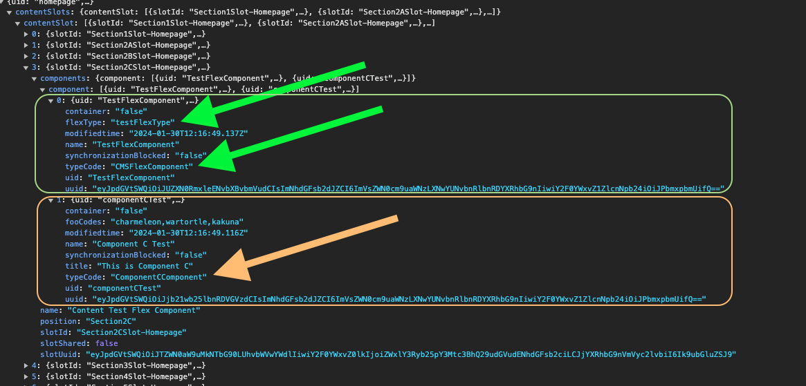
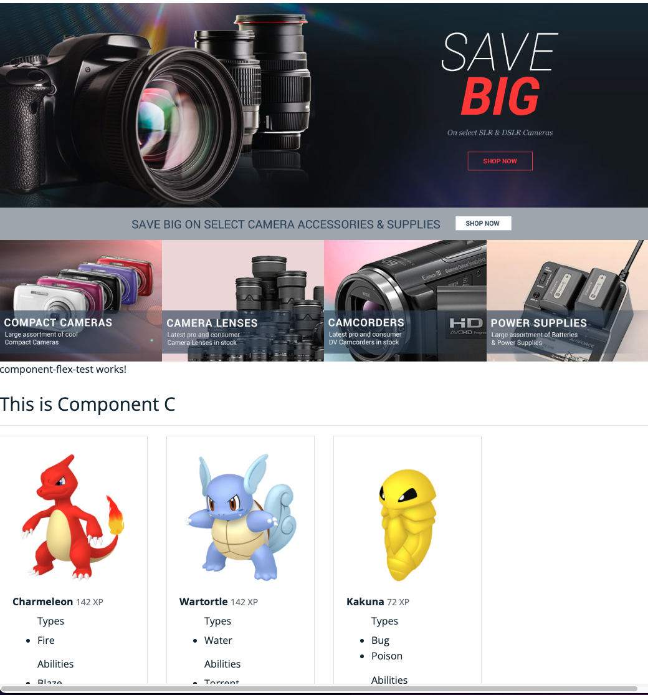

# 5. CMSFlexComponent (Special Case)

In Hybris there is a special component called `JSPIncudeComponent`. It does not contain logic, but each instance of this component can have a different template.

To translate this behavior to Spartacus, a new type of component has been created: `CMSFlexComponent`.

> [!Note] 
> Any direct migration of a Content Catalog for Spartacus use must transform the JSPIncludeComponents it contains into CMSFlexComponent.

Here is an example of the process:

Generate an instance of `CMSFlexComponent` and add it to a slot.

> [!IMPORTANT] 
> In this case, the `flexType` is absolutely necessary (otherwise it would be impossible to map the component in Spartacus).

```impex
$version = Online  
$contentCatalog=electronics-spaContentCatalog  
$contentCV=catalogVersion(CatalogVersion.catalog(Catalog.id[default=$contentCatalog]),CatalogVersion.version[default=$version])[default=$contentCatalog:$version]  
$lang=en  
  
INSERT_UPDATE ComponentCComponent; $contentCV[unique=true]; uid[unique = true]; name; title[lang = $lang]; fooCodes;&componentRef  
;; componentCTest ; Component C Test ; "This is Component C" ; charmeleon,wartortle,kakuna;componentCTest  
  
INSERT_UPDATE ComponentTypeGroups2ComponentType; source(code)[unique=true]; target(code)[unique=true]  
;wide;ComponentCComponent  
;narrow; ComponentCComponent  
  
INSERT_UPDATE ContentSlot;$contentCV[unique=true];uid[unique=true];name;active;cmsComponents(&componentRef)  
;;Section2CSlot-Homepage; Content for test Section 1 Slot;true;componentCTest  
  
INSERT_UPDATE CMSFlexComponent; $contentCV[unique = true]; uid[unique = true]; name; flexType;&componentRef  
; ; TestFlexComponent ; TestFlexComponent ; testFlexType; testFlexComponent  
  
INSERT_UPDATE ContentSlot; $contentCV[unique = true]; uid[unique = true]; name; active; cmsComponents(&componentRef)  
; ;Section2CSlot-Homepage ; Content Test Flex Component ; true ; testFlexComponent, componentCTest
```

To understand how component mapping works in Spartacus, look at the result of a CMS API request containing your `TestFlexComponent`.

<div align="center">
  
</div>

In the `Section2CSlot-Homepage` there are two components. The `typeCode` of each of them is marked with green arrows. This property is the one used by Spartacus to map the component.

What happens then when the component is a `CMSFlexComponent`? The component can have different views. In this case, you must map the component in a slightly different way.

Create a new `Component-Flex-test`, following the usual operations as already explained in the previous exercises of this course:

> [!NOTE]
> Recommended Exercises:
> - [Customizing an existing Spartacus Component](./resources/docs/exercises/01-customizing-an-existing-spartacus-component.md)
> - [Creating a new component](./resources/docs/exercises/02-creating-a-new-component.md)

- Generate the component
- Generate a module for the component and add it to the application

You will need to map it using the flexType instead of the typeCode:

```ts
import { NgModule } from '@angular/core';
import { CommonModule } from '@angular/common';
import { ComponentFlexTestComponent } from './component-flex-test.component';
import { CmsConfig, ConfigModule } from '@spartacus/core';


@NgModule({
  declarations: [
    ComponentFlexTestComponent
  ],
  imports: [
    CommonModule,
    ConfigModule.withConfig({
      cmsComponents: {
        testFlexType: {// flexType (No type Code)
          component: ComponentFlexTestComponent, // Spartacus Component
        },
      },
    } as CmsConfig),
  ]
})
export class ComponentFlexTestModule { }
```

Result:

<div align="center">
  
</div>