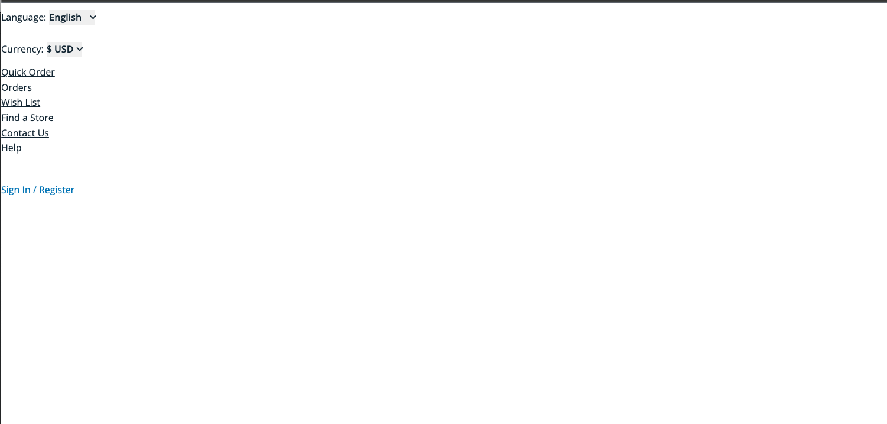
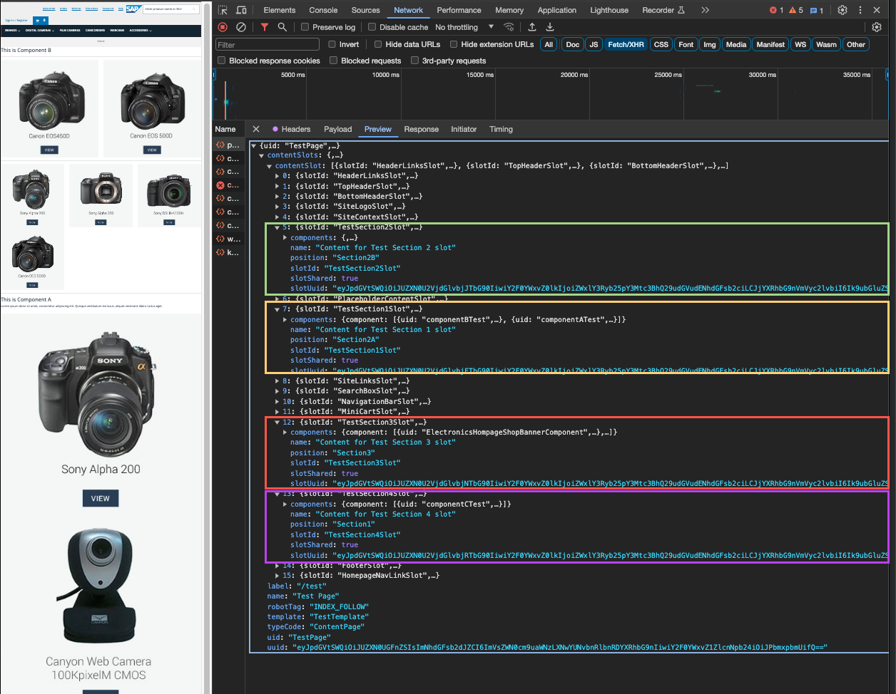
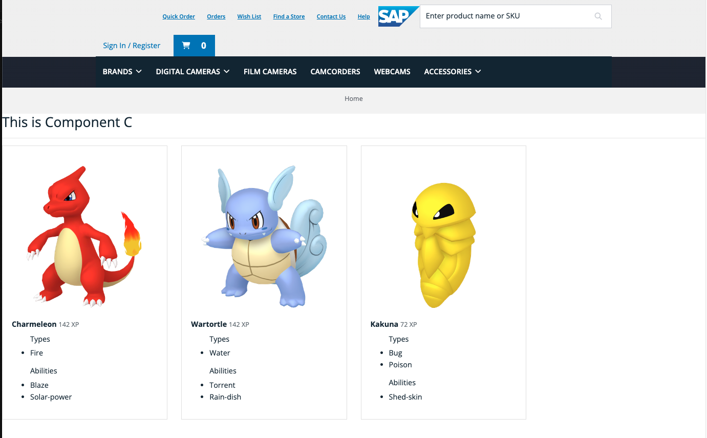

# 7. Custom Layouts

The process of using custom layouts within Spartacus is very similar to customization in components or Services: it is configured through a module that must then be added to the application.

## Building a Test Page

Below, you'll find an example of configuring a custom template using Impex, as commonly done: `TestTemplate`.

```impex
$version = Staged
$contentCatalog=electronics-spaContentCatalog
$contentCV=catalogVersion(CatalogVersion.catalog(Catalog.id[default=$contentCatalog]),CatalogVersion.version[default=$version])[default=$contentCatalog:$version]
$lang=en

INSERT_UPDATE  PageTemplate; $contentCV[unique=true]; uid[unique=true]; name; active[default=true]
;; TestTemplate ; Test Template; true

INSERT_UPDATE ContentSlotName;name[unique=true];template(uid,$contentCV)[unique=true][default='TestTemplate'];validComponentTypes(code);compTypeGroup(code)
;SiteContext;;CMSSiteContextComponent;
;SiteLinks;;CMSLinkComponent;

INSERT_UPDATE ContentSlotName;name[unique=true];template(uid,$contentCV)[unique=true][default='TestTemplate'];validComponentTypes(code);compTypeGroup(code)
;SiteLogo;;;logo
;HeaderLinks;;;headerlinks
;SearchBox;;;searchbox
;MiniCart;;;minicart
;NavigationBar;;;navigation
;Section1;;;wide
;Section2A;;;narrow
;Section2B;;;wide
;Section3;;;wide
;Footer;;;footer
;TopHeaderSlot;;;wide
;BottomHeaderSlot;;;wide
;PlaceholderContentSlot;;;
```

The shared slot names, such as `Footer` and `SiteLogo`, are utilized across the application. Each is assigned a corresponding slot, which Spartacus automatically renders.

```impex
INSERT_UPDATE ContentSlotForTemplate;$contentCV;uid[unique=true];position;pageTemplate(uid,$contentCV)[unique=true][default='TestTemplate'];contentSlot(uid,$contentCV);allowOverwrite
;;SiteLogo-TestTemplate;SiteLogo;;SiteLogoSlot;true
;;HomepageLink-TestTemplate;HomepageNavLink;;HomepageNavLinkSlot;true
;;HeaderLinks-TestTemplate;HeaderLinks;;HeaderLinksSlot;true
;;SearchBox-TestTemplate;SearchBox;;SearchBoxSlot;true
;;NavigationBar-TestTemplate;NavigationBar;;NavigationBarSlot;true
;;MiniCart-TestTemplate;MiniCart;;MiniCartSlot;true
;;Footer-TestTemplate;Footer;;FooterSlot;true
;;TopHeaderSlot-TestTemplate;TopHeaderSlot;;TopHeaderSlot;true
;;BottomHeaderSlot-TestTemplate;BottomHeaderSlot;;BottomHeaderSlot;true
;;PlaceholderContentSlot-TestTemplate;PlacehoderContentSlot;;PlaceholderContentSlot;true

INSERT_UPDATE ContentSlotForTemplate;$contentCV;uid[unique=true];position[unique=true];pageTemplate(uid,$contentCV)[unique=true];contentSlot(uid,$contentCV)[unique=true];allowOverwrite
;; SiteContextSlot-TestTemplate; SitetContext; TestTemplate; SiteContextSlot; true

INSERT_UPDATE ContentSlotForTemplate;$contentCV;uid[unique=true];position[unique=true];pageTemplate(uid,$contentCV)[unique=true];contentSlot(uid,$contentCV)[unique=true];allowOverwrite
;; SiteLinksSlot-TestTemplate; SiteLinks; TestTemplate; SiteLinksSlot; true
```

This new template is used to configure a new page and free slotNames are linked to slots filled with components.

```impex
INSERT_UPDATE ContentPage;$contentCV[unique=true];uid[unique=true];name;masterTemplate(uid,$contentCV);label;defaultPage[default='true'];approvalStatus(code)[default='approved'];homepage[default='false']
;; TestPage; Test Page ; TestTemplate; /test ;;;

INSERT_UPDATE ContentSlot; $contentCV[unique = true]; uid[unique = true]; name; active[default=true]; cmsComponents(uid,$contentCV)
;; TestSection1Slot; Content for Test Section 1 slot; ;componentBTest, componentATest
;; TestSection2Slot; Content for Test Section 2 slot; ;ElectronicsSonyA200BannerComponent,ElectronicsHompageSmDiscountBannerComponent
;; TestSection3Slot; Content for Test Section 3 slot; ;ElectronicsHompageShopBannerComponent,ElectronicsHompageShipmentBannerComponent
;; TestSection4Slot; Content for Test Section 4 slot; ; componentCTest

INSERT_UPDATE ContentSlotForTemplate;$contentCV;uid[unique=true];position[unique=true];pageTemplate(uid,$contentCV)[unique=true][default='TestTemplate'];contentSlot(uid,$contentCV)[unique=true];allowOverwrite
;; Section1-TestSection4Slot; Section1 ;; TestSection4Slot ;true
;; Section2A-TestSection1Slot; Section2A ;; TestSection1Slot;true
;; Section2B-TestSection2lot; Section2B ;; TestSection2Slot;true
;; Section3-TestSection3Slot; Section3 ;; TestSection3Slot;true
```

Now you can access via Spartacus and see the new page. However, if you access the page using Spartacus, it displays a basic page without components. This occurs because Spartacus does not know how to render them, necessitating the mapping of this new layout.

<div align="center">
  
</div>

## Custom Layouts in Spartacus

Create a new module called `custom-layout`, where you will define how the page should be displayed.

```
ng g m custom-layout
```

```ts
import { NgModule } from '@angular/core';
import { CommonModule } from '@angular/common';
import { ConfigModule } from '@spartacus/core';
import { LayoutConfig } from '@spartacus/storefront';

@NgModule({
  declarations: [],
  imports: [
    CommonModule,
    ConfigModule,
    ConfigModule.withConfig({
      layoutSlots: {
        ContentPage1Templat: {
          slots: ['Section1', 'Section2B', 'Section3'],
        },
        TestTemplate: {
          slots: ['Section2A', 'Section2B', 'Section3'],
          xl: {
            slots: ['Section1'],
          },
        },
      },
    } as LayoutConfig),
  ],
})
export class CustomLayoutModule {}
```

In this case, the `ContentPage1Template` is reconfigured as the default ('Out of the Box') configuration does not include all the slots. Additionally, the `TestTemplate` is also added, although `Section1` has been omitted.

Result:

<div align="center">
  
</div>

It should be noted that it is important to establish the order of the slots, since the response from the server sends an unordered list of slots. They will be displayed on screen in that order.

<div align="center">
  
</div>

`Section1` with the ComponentCTest component is effectively being omitted.
`Section1` appears alone on extra large viewports(`xl`):

<div align="center">
  
</div>

Be cautious with generic slot and breakpoint settings. A breakpoint setting always overrides a generic slot configuration. Additionally, settings for smaller breakpoints are inherited by larger breakpoints unless otherwise specified (similar to CSS media queries)

For example, if you configure settings specifically for extra-small screens and also set a generic slot configuration, the generic configuration will not be displayed.

This configuration offers extensive flexibility, including the ability to reconfigure breakpoints, assign specific slots to the header or footer, and hide or display slots based on screen resolution. Additionally, it allows for the positioning of the `pageFold` and more.The options are huge and can be adjusted globally or for a specific template.

> [!NOTE]
> In web design, `pageFold` refers to the part of a webpage visible without scrolling down. It's like the fold in a newspaper where what's above the fold is what you first see. On a webpage, the pageFold is everything you see on the screen initially, before you start scrolling.

Example of a template provided by Spartacus:

```ts
VariantConfigurationTemplate: {  
  header:{  
    lg:{  
      slots: [  
        'PreHeader',  
        'SiteLogo',  
        'VariantConfigExitButton',  
        'MiniCart',  
      ]  
    },  
    xs:{  
      slots:[  
        'PreHeader',  
        'SiteLogo',  
        'variantConfigExitButton',  
        'MiniCart',  
      ]  
    }  
  },  
  navigation:{  
    lg: {slots:[]},  
    slots:['VariantConfigMenu']  
  }  
    ...  
}
```

In this other example, you can see how the general footer is configured and then the slots for the Template:

```ts
  layoutSlots: {
	footer: {
	  slots: DEFAULT_FOOTER_SLOT_CONFIG,
	},
	page_template_1: {
	  slots: DEFAULT_SLOTS_CONFIG,
	  md: {
		slots: SLOT_CONFIG_FOR_MD,
	  },
	  footer: {
		md: {
		  slots: FOOTER_SLOT_CONFIG_FOR_MD,
		},
	  },
	},
	page_template_2: {
	  fppter: {
		slots: FOOTER_SLOTS_CONFIG_FOR_PAGE2,
	  },
	},
  },
```

