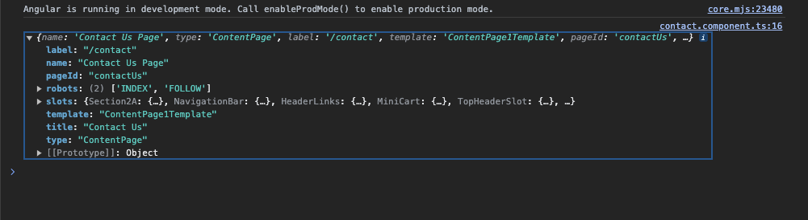

# Content Page

## Table of Contents

1. [Overview](#overview)
2. [How Does It Work?](##how-does-it-work)
3. [Where to Find It?](#where-to-find-it)
4. [How to Add Another Content Page Without the Use of CMS?](#how-to-add-another-content-page-without-the-use-of-cms)
5. [How to Embed the Static Page in Spartacus Layout?](#how-to-embed-the-static-page-in-spartacus-layout)
6. [How to Change the Label "Not Found"?](#how-to-change-the-label-not-found)
7. [Creating a New Shopping Cart](#creating-a-new-shopping-cart)
8. [How to Configure Aliases?](#how-to-configure-aliases)
9. [How to Extend from an Existing Content Page?](##how-to-extend-from-an-existing-content-page)

### Overview

Content pages refer to all the pages that are created in the **CMS**. For example, `/contact` and `/faq` are considered *content pages*.

## How Does It Works?

Spartacus uses a feature known as ***Wildcard Routes***. If Spartacus fails to find any route in its configuration, it will invoke the **backend** to attempt to retrieve the route. This implies that they are ***CMS-driven routes***.

## Where to Find It?

**Content Pages** can be find in the upper-right corner.

## How to Add Another *Content Page* Without the Use of CMS?

### Step 1. Generate the **Static Page**

```bash
ng generate component static-page
```

or shorter

```bash
ng g c static-page
```

### Step 2. Configure a Route for This New Static Page 

> [!NOTE]
> It's a good practice to organize configurations in separate modules

```bash
ng generate module custom-routing
```

or 

```bash
ng g m custom-routing
```

### Step 3. Add **Angular Router** to `src/app/custom-routing/custom-routing.module.ts`

```typescript
...

const STATIC_ROUTES: Routes = [
  {
  	path: 'static-page',
  	component: StaticPageComponent
  },
];

@NgModule({
  declarations: [],
  imports: [
    CommonModule,
    RouterModule.forChild(STATIC_ROUTES)
  ]
})
export class CustomRoutingModule { }
```

### Step 4. Import **CustomRoutingModule** in **AppModule**.
### Step 5. Check everything is working

```http
http://localhost:4200/electronics-spa/en/USD/static-page
```

> [!NOTE]
> It should appear the content of `static-page.component.html`.

## How to Embed the Static Page in *Spartacus* Layout?

To do so you need to use a special **CMS Guard**.

### Step 1. Add `CmsPageGuard` in the `STATIC_ROUTES` Constant of `CustomRoutingModule`.

```ts
...

const STATIC_ROUTES: Routes = [
	{
		path: 'static-page',
		component: StaticPageComponent,
		canActivate: [CmsPageGuard]
	},
];
...
```

### Step 2. Now It Will Be Rendered in the *Spartacus* layout. Go Back to The Page

```http
http://localhost:4200/electronics-spa/en/USD/static-page
```


## How to Change the Label "Not Found"?

> [!NOTE]
> The "Not Found" label appears because the label comes from the **CMS**, and when Spartacus tries to find the route in the CMS, it does not exist.

1. Pass data in `STATIC_ROUTES` constant

```typescript
...

const STATIC_ROUTES: Routes = [
	{
		path: 'static-page',
		component: StaticPageComponent,
		canActivate: [CmsPageGuard],
		data:{ pageLabel: 'cart' }
	},
];
...
```

> [!NOTE]
> You can use "cart" as the pageLabel because it has *CMS Content Page*. Other examples include "faq", "contact", "store-finder", and others.

## Creating a New Shopping Cart

### Step 1. Inject `ActiveCartService` to the `StaticPageComponent`

```typescript
...

@Component({
  selector: 'app-static-page',
  templateUrl: './static-page.component.html',
  styleUrls: ['./static-page.component.scss']
})
export class StaticPageComponent {

  constructor(private cartService: ActiveCartService) {
  }
}
```

### Step 2. Save *OrderEntries* into an *Observable*

```ts
...
orderEntries: Observable<OrderEntry[]> = this.cartService.getEntries();
...
```

### Step 3. Create a *pre* Tag to Render *JSON*. Implement it Asynchronously to Subscribe to the Observable and Format the JSON to Display It Nicely in `static-page.component.html`.

```html
<pre>{{ orderEntries | async | json }}</pre>
```

### Step 4. Remember to Add *ActiveCartService** as **provider** in Your Module `AppModule`

```ts
...
providers: [ActiveCartService],
...
```

## How to Configure Aliases?

### Step 1. Create a New Path in Your `CustomRoutingModule` but in This Case We will Use an *Spartacus* Built in Component Called `PageLayoutComponent`

```ts
{
  path: 'alias/tr',
  component: PageLayoutComponent,
  data: { pageLabel: '/faq' },
  canActivate: [CmsPageGuard]
}
```

### Step 2. Check if the alias redirects you to **faq** content page:

```http
http://localhost:4200/electronics-spa/en/USD/alias/tr
```

> [!NOTE]
> Notice how you can also add "/" to your `pageLabel`. Also, you can place whatever you want in the `path`.

## How to Extend From an Existing Content Page?

### Step 1. Provide the Address of the Content Page in `CustomRoutingModule`

```ts
...

const STATIC_ROUTES: Routes = [
...,
  {
    path: 'contact',
    component: ContactComponent,
    data: { pageLabel: '/contact' },
    canActivate: [CmsPageGuard]
  }
]
...
```

### Step 2. Create a New Component

```sh
ng generate component contact
```

### Step 3. Inject `CmsService` to get the Content Page Data in `ContactComponent`. Subscribe to the Data to Ensure it is Working, and Check the Browser Console for Output.

```ts
...

@Component({
  selector: 'app-contact',
  templateUrl: './contact.component.html',
  styleUrls: ['./contact.component.scss']
})
export class ContactComponent {

  constructor( private cmsService: CmsService) {
  }

  ngOnInit(): void {
    this.cmsService.getCurrentPage().subscribe(console.log);
  }
}
```

```http
http://localhost:4200/electronics-spa/en/USD/contact
```

Browser Example: 

