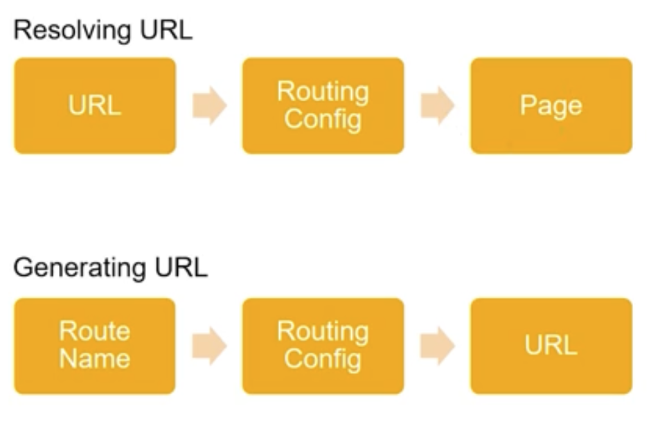
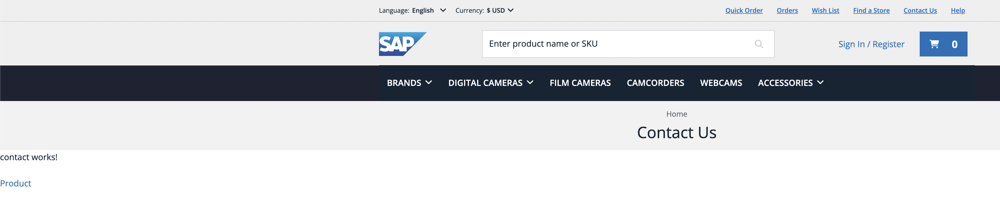
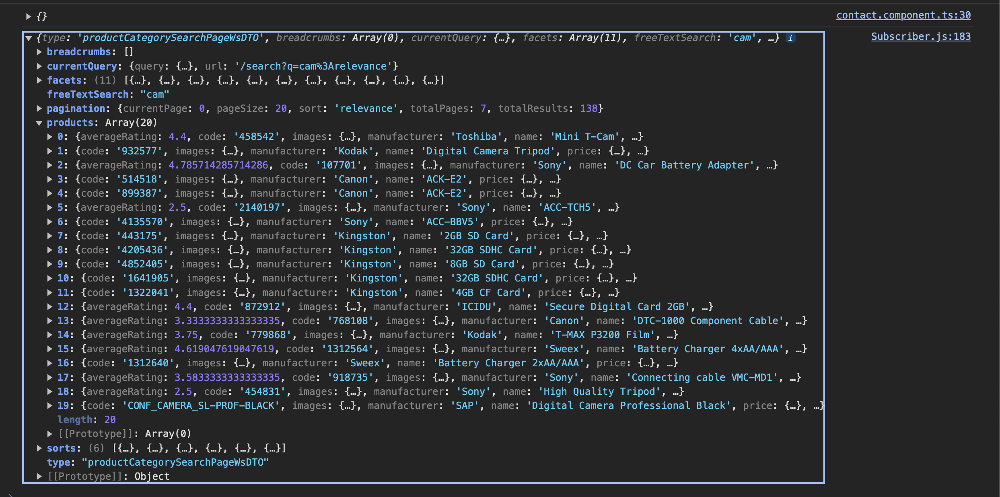

# Using Router Links

## Table of Contents

1. [Resolving and Generating URLs](#resolving-and-generating-urls)
2. [Creating Links in Angular / Old Fashion Way](#creating-links-in-angular-the-old-fashioned-way)
3. [Creating Link using *cxUrl pipe*](#creating-link-using-cxurl-pipe)
4. [Creating a Link using Programmatic Navigation](#creating-a-link-using-programmatic-navigation)

## Resolving and Generating URLs



## Creating Links in Angular the Old-Fashioned Way

### Step 1. Add Link to a Product in *Contact Content Page*

```html
<p>contact works!</p>
<a routerLink="/electronics/cameras/Digital%20Compacts%2FHP/300938/HP/photosmart-e317-digital-camera">Product</a>
```

> [!NOTE]
> The *routerLink* route can be the route of the product of your choice

> [!WARNING]
> Don't forget the "**/**" at start of the url
> Use the correct relative route. For example, `/electronics-spa/en/USD/electronics/cameras/Digital%2520Compacts%252FHP/300938/HP/photosmart-e317-digital-camera`. Avoid including the base site, language, and currency in the path.

### Step 2. Add `RouterModule` to Your `AppModule`

```ts
...
imports: [
	...
    RouterModule
  ],
...
```

### Step 3. Verify that the Link Works on the *Contact Content Page*



> [!IMPORTANT]
> Although it works, it is not the best practice since we are hardcoding the route. For example, if we modify all the paths in `CustomRoutingModule`, it will not work.
>
> ```ts
> ...
> paths: [
>   'el/cameras/:allCategories/:productCode/:manufacturer/:name',
>   'el/cameras/:firstCategory/:productCode/:manufacturer/:name',
>   'el/cameras/:productCode/:manufacturer/:name',
>   'el/cameras/:productCode/:name',
>   'el/cameras/:productCode',
> ],
> ...
> ```

## Creating Link Using the *cxUrl pipe*

### Step 1. Add a Link to a Product in the *Contact Content Page*

```html
<p>contact works!</p>
<a routerLink="/electronics/cameras/Digital%20Compacts%2FHP/300938/HP/photosmart-e317-digital-camera">Product</a>
<br />
<a [routerLink]="{ cxRoute: 'product', params: { code: '300938' } } | cxUrl">cxUrl Product</a>
```

What we are doing here is creating an object that defines the route. `cxRoute: 'product'` specifies the route name, and `params: { code: '300938' }` passes a parameter to the route. Meanwhile, `| cxUrl` is a pipe in Angular, which is used to transform output in your template. `cxUrl` is likely a custom pipe that transforms the route object into a URL.


### Step 2. Add `RouterModule` in Your `AppModule`

```ts
...
imports: [
	...
    UrlModule
  ],
...
```

### Step 3. Verify that the Link Works on the *Contact Content Page*

> [!IMPORTANT]
> Note that it is much safer to use `cxUrl` because if you make any changes to the routes, it will still work.

## Creating a Link Using Programmatic Navigation

We will create a new link that redirects the user to a random product page when clicked.

### Step 1. Create a New button in `ContactComponent`

```ts
...
<button type="button" (click)="goToRandomProduct()">I'm feeling lucky!</button>
```

### Step 2. Implement the `goToRandomProduct` Method in `ContactComponent`

1. Inject `RoutingService`

```ts
...
constructor( ..., private routingService: RoutingService) {

}
...
```

2. Create `goToRandomProduct()` and call `RoutingService` to make the button functional

```ts
goToRandomProduct(): void {
  this.routingService.go({ cxRoute: 'product', params: { code: '300938' } })
}
```

What is happening here is that we are calling `routingService#go`, which allows us navigation, and we are passing the same object as we did with the *cxUrl* pipe.

### Step 3. Check What the Button Does in the *Contact Content Page*

If you notice, it always redirects to the same product. To change this behavior, we need to utilize the `ProductSearchService`.

### Step 4. Inject `ProductSearchService` in `ContactComponent`

```ts
constructor( ..., private productSearchService: ProductSearchService) {

}
```

### Step 5. Use `ProductSearchService` in `goToRandomProduct` Method

> [!IMPORTANT]
> - The `ProductSearchService#search` is used to trigger the search action, but it doesn't return any results. If we want to get the results, we must use `ProductSearchService#getResults` after calling the `search` method. The main reason for doing this is because Spartacus uses NgRx (State Management with Observables), and the search action performs a backend call in the background. When the results are ready, the NgRx state is populated with the results.
> - What we are doing with `ProductSearchService#getResults#subscribe` is subscribing to the observable, which will inform us when the results are ready.


> [!NOTE]
> - In *search*, we pass query strings which can be empty, and then we will get some arbitrary products, or we can pass a search phrase like "cam".
> - We can also pass another parameter, which is the search query, but it is optional.

```ts
goToRandomProduct(): void {
  this.productSearchService.search('cam');
  this.productSearchService
    .getResults()
    .subscribe(console.log);
  // this.routingService.go({ cxRoute: 'product', params: { code: '300938' } })
}
```

If we do this and go to the contact content page and open the terminal, when we click the button, we will see a lot of rows. This is because we are subscribing immediately to the search results before the results are actually available.



Since we only want products, we need to use an *RxJS operator*.

```ts
...
import { filter, pluck } from 'rxjs/operators';

...

goToRandomProduct(): void {
  this.productSearchService.search('cam');
  this.productSearchService
    .getResults()
    .pipe(
      filter((res) => res.hasOwnProperty('products')),
      pluck('products'),
    )
    .subscribe(console.log);
  // this.routingService.go({ cxRoute: 'product', params: { code: '300938' } })
}
...
```

> [!NOTE] 
> We are using `filter` to retrieve only the rows that contain products and `pluck` to extract only the products array.

If we click the button, we will get more and more rows of products because every time we click the button, another subscription is being created and run concurrently, which is not the desired behavior. To fix this, we need to use another operator called `take` and pass the number "1" to subscribe only once and then terminate the subscription.

```ts
...
import { filter, pluck, take } from 'rxjs/operators';

...

goToRandomProduct(): void {
  this.productSearchService.search('cam');
  this.productSearchService
    .getResults()
    .pipe(
      filter((res) => res.hasOwnProperty('products')),
      pluck('products'),
      take(1)
    )
    .subscribe(console.log);
  // this.routingService.go({ cxRoute: 'product', params: { code: '300938' } })
}
...
```

Now we can observe that each click results in receiving only one array of products.

### Step 6. Pick a Random Product

```ts
...
goToRandomProduct(): void {
  this.productSearchService.search('cam');
  this.productSearchService
    .getResults()
    .pipe(
	  filter((res) => res.hasOwnProperty('products')),
	  pluck('products'),
      take(1)
    )
	.subscribe((products: TrProduct[] | undefined) => {
      if (products) {
        const randomProduct = products[getRandomIndex(products)];
        this.routingService.go({
          cxRoute: 'product',
          params: { code: randomProduct.code },
        });
      }
    });
}

private getRandomIndex(array: any) : number {
  return Math.floor(Math.random() * array.length)
}
...
```

> [!NOTE]
> The function used to get a random product index is a *JavaScript* trick. What we are doing is generating a random number that must be within the range of the array length and then rounding the number because the result is a float.
